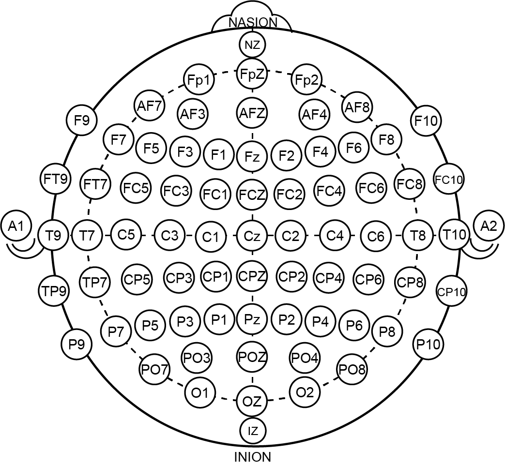

# Brain-Computer Interfacing Bootcamp


Hi there! We are the **Brain-Computer Interfacing (BCI) research and study group** at Saturdays.AI Madrid.

[Saturdays.AI](https://saturdays.ai) is a global initiative to democratize access to Artificial Intelligence education at the quality and rigour of the world’s best universities, in the form of 14-week bootcamps.

We've partnered with [Bitbrain](https://bitbrain.com), a leading world-class neurotechnology company, to explore projects at the intersection of Brain-Computer Interfacing (BCI) and Artificial Intelligence (AI).


## The bootcamp course [`/course`](/course)

[👉 Course wiki and resources 👈](https://docs.google.com/document/d/13fspNmq4XXVakqQDpvZr9C372Ysb_eovWZsxX8acEPM/edit?usp=sharing)  [Beta, 👨‍💻 under development]

As part of this collaboration and within the context of Saturdays.AI, our main goal is to create an introductory Brain-Computer Interfacing bootcamp to be done over the course of 14 weeks.

We ourselves will be the first students and beta users of this course, which, if successful, will be exported to the rest of the cities in the [Saturdays.AI](https://saturdays.ai) network as a new specialization path together with the usual Machine Learning, Deep Learning and Reinforcement Learning specialization paths.

The course will propose a number of readings and resources to read through the week and will introduce a related code-based challenge to solve during the hands-on team meeting on Saturdays.


## From zero to BCI

The end goal is to go from zero to "move objects with the mind" in ~14 weeks.

Technically, this bootcamp course is based on creating Brain-Computer Interfaces (BCI) / Brain-Machine Interfaces (BMI) using electroencephalogram (EEG) data captured with a headset. We use a Bitbrain 16-channel EEG headset (as seen in the picture), plus some data science, signal processing and machine learning to create classifiers capable of transforming brainwaves into actions.


## Prerequisites

To make the most out of the bootcamp (and even to be able to follow the course) you need to have:

 - [x] Solid programming knowledge (Python) – this is a must.
 
    _You don't have to be the best programmer in the world, but you definitely need to look at code and (1) not be afraid of it and (2) understand most of it._

 - [x] Data Science / Data Analytics skills: you need to be comfortable using `pandas`, `numpy`, `matplotlib`...
 
 - [x] Passion for exploring world-changing technologies like BCIs.

 - [x] Some knowledge on signal processing, math and/or an engineering background are not required, but definitely helpful.


## Available datasets [`/data`](/data)

<p align="center">
   
</p>

We're using a [Bitbrain EEG headset](https://www.bitbrain.com/neurotechnology-products/semi-dry-eeg/versatile-eeg) (semi-dry water electrodes) to record our datasets. All electrodes were placed following a 10-20 system, the precise location of electrodes and correlation with channel numbers are [documented for each dataset](data/README.md).

👉 Please see our [dataset docummentation](data/README.md) for further info. 


## The BBTools library [`/course/bbtools`](/course/bbtools)

We usually find ourselves using the same functions over and over again, so we're developing a library called BBTools (BitBrain Tools), to encapsulate some common behavior we need when importing and handling data from our Bitbrain headset.

For example, reading Bitbrain `csv` data is as easy as:

```
import bbtools as bbt
raw = bbt.read_csv(csv, channels)
```

Further documentation and usage examples can be found within the notebooks.


## Ongoing experiments [`/dev`](/dev)

Ongoing experiments are located under the `/dev` folder to keep the `course` folder uncluttered and easy to follow.

Our initial experiments exploring approaches to move objects with our minds can be found in [`/dev/first-experiments`](/dev/first-experiments).

## How to contribute

PRs are welcome.

If you make contributions to a notebook, feel free to add yourself as one of the authors at the top of said notebook.

Adding Markdown cells to the notebooks to explain unclear things is always a plus, so feel free to add any necessary documentation.

Please contact us with any questions!

-The BCI team at Saturdays.AI Madrid

